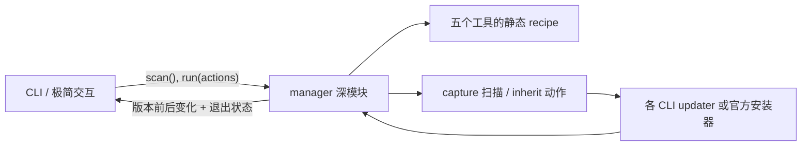

# ai-cli-manager 简化设计提案

> 状态：设计候选；尚未修改生产代码。
> 目标：加入 OMP，同时减少代码量、概念数量和用户决策。

## 结论

`ai-cli-manager` 不应继续尝试成为 npm、Homebrew、Bun、pnpm、Yarn、mise、
WinGet 等安装管理器的统一抽象。它只需要管理当前 shell 实际执行的命令：

1. 用各 CLI 的 `--version` 判断“已安装 / 未安装 / 版本不可读”；
2. 未安装时只提供一个经过审查的推荐安装入口；
3. 已安装时调用该 CLI 自己的更新命令；
4. 更新后重新读取版本，只报告“已变化 / 无变化 / 失败”，不猜测安装来源；
5. 详细模式才展示实际命令和上游输出。

这是有意缩小产品承诺。管理器负责发现、编排、安全执行和一致呈现；安装归属识别、
迁移、原子替换与回滚由更了解自身发布方式的上游 CLI 负责。

## 为什么当前模型越来越浅

当前生产代码共 1,177 行，其中 `detector.ts` 占 404 行。现有接口要求每个工具都声明
`official`、`npm`、`homebrew` 三种来源，再由 detector 盘点 PATH、npm 全局目录、
Homebrew prefix 和官方 marker。这个模型有三个结构性问题：

- 接口很大，但仍表达不了 Bun、pnpm、Yarn、mise、WinGet、apt 等真实来源；
- “安装入口”和“最终归属”混在一起，例如 Pi 官方脚本最终仍是 npm 安装，OMP 官方
  脚本可能选择 Bun 或独立二进制；
- 管理器绕开了上游更深的更新实现，例如 OMP 的来源识别、依赖版本锁定、校验、回滚，
  以及 Pi 的包 scope 迁移。

继续扩展 `Source` 联合类型只会增加浅层 adapter 和分支。删除模块后，这些复杂性不会
转移到调用方，而是直接消失，因此来源盘点模块没有通过 deletion test。

## 最大程度复用上游能力

| CLI | 推荐安装入口 | 更新委托 | 管理器需要知道的例外 |
| --- | --- | --- | --- |
| Claude Code | 官方 native 安装脚本 | `claude update` | npm 已弃用；上游更新行为以 native 为主，其他来源失败时如实展示 |
| Codex | 官方 standalone 安装脚本 | `codex update` | 上游已识别 npm、Bun、pnpm、Homebrew、standalone |
| Kimi Code | 官方 native 安装脚本 | `kimi update` | 必须继承真实 TTY；部分来源只会输出手动命令 |
| Pi | `npm install -g --ignore-scripts @earendil-works/pi-coding-agent` | `pi update --self` | 上游负责旧 scope 迁移；不支持的来源会由上游拒绝 |
| OMP | 官方安装脚本 | `omp update` | 上游已识别 Homebrew、mise、Bun、npm、standalone，并负责校验回滚 |

依据见同目录树中的一手资料研究：

- [Claude Code](../research/claude-code-install-and-update.md)
- [Codex](../research/codex-install-and-update.md)
- [Kimi Code](../research/kimi-code-install-and-update.md)
- [Pi](../research/pi-install-and-update.md)
- [OMP](../research/omp-install-and-update.md)

安装不能委托给尚未存在的 CLI，因此 catalog 仍需保留五条推荐安装 recipe。更新则一律
先委托当前 PATH 中生效的命令。Kimi 的 TTY 差异不应变成专用更新实现：动作执行阶段
统一继承终端，既让 Kimi 正常询问，也让其他 CLI 的进度输出保持原样。

## 建议的产品语义

### 管理“当前命令”，不管理“所有安装副本”

PATH 决定用户输入 `codex` 时实际运行哪一个 Codex。管理器只扫描和操作这个实例。
如果机器上还有一个被 PATH 遮蔽的副本，它不属于默认界面的关键信息，也不应驱动更新
计划。需要排查时，可在详细模式中提示用户使用系统工具检查 PATH。

这个决定允许删除：

- npm global inventory；
- Homebrew inventory；
- official marker 和 path prefix 规则；
- `Source`、`Installation[]`、confidence、evidence、legacy source 状态；
- 安装来源选择器及其可用性探测；
- 按来源查询 latest 的分支。

### 不在扫描阶段判断“已是最新”

只有 OMP 提供稳定的只读 `--check`，其他工具的更新检查在通道、TTY 和安装来源上语义
不同。为了一个不一致的绿色勾选维护五套 latest 协议，收益小于复杂度。

默认扫描应完全本地化，只展示当前版本。用户选择更新后，上游 updater 自己判断是否
需要动作。执行前后版本比较提供三个不会误导的结果：

- 版本变化：`已更新 0.147.0 → 0.148.0`；
- 版本未变且退出码为 0：`无变化（已是最新，或上游给出了手动步骤）`；
- 非零退出：`失败`，保留上游错误输出。

因此可以删除 `--offline` 以及远程 latest 获取逻辑。不要把“无变化”写成“成功更新”。

### 安装只给一个默认入口

用户选择的是“安装 OMP”，不是“先理解 OMP 的五种发布来源”。默认界面不再询问
official/npm/Homebrew。替代安装方式属于上游文档；高级用户可以自行安装，随后管理器
会通过 PATH 发现它。

## 深模块与接口

建议保留一个深的 `manager` 模块，CLI 和测试都只跨同一个 seam：

```ts
interface CliManager {
  scan(): Promise<ToolStatus[]>;
  run(actions: Action[]): Promise<ActionResult[]>;
}

interface ToolStatus {
  id: ToolId;
  label: string;
  state: "missing" | "installed" | "unreadable";
  version?: string;
  action: "install" | "update";
  preview: string;
}
```

`catalog`、PATH 命令解析、recipe 生成、安全脚本下载、进程生命周期、更新后复检都放在
实现内部。`CommandRunner` 仍是合理的内部 seam，因为它已有真实进程 adapter 与测试
adapter 两种实现。



不建议为五个工具各建 class 或公开 adapter interface。当前差异能由静态 recipe 表达，
只有一个实现的 seam 只是额外间接层。若未来确实出现第二种不可数据化行为，再提取内部
adapter。

## CLI 交互建议

建议从 flags 改成少量子命令；无需保留旧参数兼容：

```text
ai-cli-manager                 # 交互选择
ai-cli-manager status          # 本地版本状态
ai-cli-manager status --json   # 机器可读状态
ai-cli-manager install omp     # 安装缺失工具
ai-cli-manager update          # 更新全部已安装工具
ai-cli-manager update codex pi # 更新指定工具
```

默认交互只展示三类关键信息：工具、当前版本或“未安装”、将执行的动作。来源、PATH、
完整命令和说明通过 `D` 展开。选择后再显示一次精确计划并确认，避免把所有审计信息长期
铺在主列表里。

推荐采用原型中的 **C：渐进披露**：

1. 首屏是一行摘要和一张紧凑清单；
2. 用一个意图菜单组合“安装缺失工具”和“更新已安装工具”，不再进入“选择安装来源”的
   第二层菜单；
3. `D` 显示精确命令与交互性提示；
4. Enter 进入确认；执行时把终端交给上游；
5. 结束后只显示变化和失败，无变化保持中性。

可运行原型见 [CLI UX prototype](../../prototypes/prototype-cli-ux.html)。

## 代码量约束

这次重构应设删除预算，而不是在旧模型上叠加 OMP：

- 删除来源 inventory、marker、source availability、source picker 和 remote latest；
- 保留 runner 的超时、进程树终止、`shell: false` 与脚本 HTTPS 白名单；
- 新增 OMP 只应是一条 catalog 数据，而不是新的 detector 分支；
- 测试改为穿过 `manager` 接口验证可观察行为，旧的来源实现测试直接删除。

预计新增的 OMP recipe、交互执行模式和子命令解析应明显少于被删除的代码。验收时可以
使用硬约束：重构后的 `src/` 总行数必须低于当前 1,177 行，并且 catalog 外不允许出现
`tool.id === ...` 的工具专用分支。

## 明确保留的安全能力

极简不等于把官方脚本重新改成 `curl | sh`。以下能力应保留：

- 安装器只允许 HTTPS 和 catalog 白名单域名，包括 Codex 当前重定向到的
  `releases.openai.com`；
- 下载到临时文件、限制体积、执行后清理；
- 不通过 shell 拼接命令，参数以数组传递；
- 动作超时后终止整个进程树；
- 执行前显示将运行的上游命令或脚本 URL；
- 动作后复检，不把退出码 0 自动等价为“版本已更新”。

## 暂不做

- 不盘点 PATH 外的重复安装；
- 不替用户统一安装来源；
- 不解析五种 updater 的文本输出；
- 不实现自己的版本通道、迁移或回滚；
- 不为了 OMP 单独展示 `update --check`；
- 不为 catalog 提前抽象 plugin 系统。

这些取舍共同保证 OMP 的加入扩大能力，但不会扩大核心模型。
