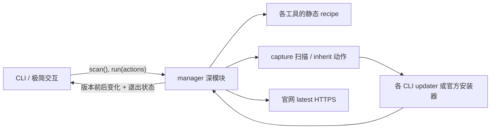

# ai-cli-manager 简化设计提案

> 状态：核心设计已落地；2026-08-24 增补只读来源推断与官网 latest 核验。
> 目标：扩大工具覆盖，同时减少代码量、概念数量和用户决策。

## 结论

`ai-cli-manager` 不应继续尝试成为 npm、Homebrew、Bun、pnpm、Yarn、mise、
WinGet 等安装管理器的统一抽象。它只需要管理当前 shell 实际执行的命令：

1. 用各 CLI 的 `--version` 判断“已安装 / 未安装 / 版本不可读”；
2. 未安装时只提供一个经过审查的推荐安装入口；
3. 已安装时调用该 CLI 自己的更新命令；
4. 更新后重新读取版本，并独立对比官网 latest；安装来源不参与动作决策；
5. 详细模式才展示实际命令和上游输出。

这是有意缩小产品承诺。管理器负责发现、编排、安全执行和一致呈现；安装归属识别、
迁移、原子替换与回滚由更了解自身发布方式的上游 CLI 负责。

## 为什么当前模型越来越浅

重构前生产代码共 1,177 行，其中 `detector.ts` 占 404 行。旧接口要求每个工具都声明
`official`、`npm`、`homebrew` 三种来源，再由 detector 盘点 PATH、npm 全局目录、
Homebrew prefix 和官方 marker。这个模型有三个结构性问题：

- 接口很大，但仍表达不了 Bun、pnpm、Yarn、mise、WinGet、apt 等真实来源；
- “安装入口”和“最终归属”混在一起，例如 Pi 官方脚本最终仍是 npm 安装，OMP 官方
  脚本可能选择 Bun 或独立二进制；
- 管理器绕开了上游更深的更新实现，例如 OMP 的来源识别、依赖版本锁定、校验、回滚，
  以及 Pi 的包 scope 迁移。

继续为每种来源扩展 inventory、latest 和动作 adapter 只会增加浅层分支。删除模块后，
这些复杂性不会转移到调用方，而是直接消失，因此重量级来源盘点模块没有通过 deletion
test。当前实现只保留不驱动动作的路径标签。

## 最大程度复用上游能力

| CLI | 推荐安装入口 | 更新委托 | 管理器需要知道的例外 |
| --- | --- | --- | --- |
| Claude Code | 官方 native 安装脚本 | `claude update` | npm 已弃用；上游更新行为以 native 为主，其他来源失败时如实展示 |
| Codex | 官方 standalone 安装脚本 | `codex update` | 上游已识别 npm、Bun、pnpm、Homebrew、standalone |
| Kimi Code | 官方 native 安装脚本 | `kimi update` | 必须继承真实 TTY；部分来源只会输出手动命令 |
| Pi | `npm install -g --ignore-scripts @earendil-works/pi-coding-agent` | `pi update --self` | 上游负责旧 scope 迁移；不支持的来源会由上游拒绝 |
| OMP | 官方安装脚本 | `omp update` | 上游已识别 Homebrew、mise、Bun、npm、standalone，并负责校验回滚 |

依据见同目录树中的一手资料研究：

- [Claude Code](../research/claude-code-install-and-update.md)
- [Codex](../research/codex-install-and-update.md)
- [Kimi Code](../research/kimi-code-install-and-update.md)
- [Pi](../research/pi-install-and-update.md)
- [OMP](../research/omp-install-and-update.md)

安装不能委托给尚未存在的 CLI，因此 catalog 仍需保留各工具的推荐安装 recipe。更新则一律
先委托当前 PATH 中生效的命令。Kimi 的 TTY 差异不应变成专用更新实现：动作执行阶段
统一继承终端，既让 Kimi 正常询问，也让其他 CLI 的进度输出保持原样。

## 建议的产品语义

### 管理“当前命令”，不管理“所有安装副本”

PATH 决定用户输入 `codex` 时实际运行哪一个 Codex。管理器只扫描和操作这个实例。
如果机器上还有一个被 PATH 遮蔽的副本，它不属于默认界面的关键信息，也不应驱动更新
计划。需要排查时，可在详细模式中提示用户使用系统工具检查 PATH。

这个决定允许删除重量级来源盘点：

- npm global inventory；
- Homebrew inventory；
- official marker 和 path prefix 规则；
- `Installation[]`、confidence、evidence、legacy source 状态；
- 安装来源选择器及其可用性探测；
- 按来源查询 latest 的分支。

### 独立核验官网 latest，不信任 updater 的“最新版”结论

updater 仍负责实际更新，但它可能受 stable 通道、npm 镜像、本地配置或 PATH 副本影响。
管理器不解析 updater 文本，而是直接读取 catalog 声明的官方 HTTPS 端点，并通过共享解析
逻辑得到 `latestVersion`。这不是来源 inventory：每个工具只增加 URL 和可选 JSON 字段名，
没有来源专用 adapter。

默认 `status` 联网核验，`status --local` 保留完全本地化扫描。结果只允许四种语义：

- `current`：本地版本严格等于官网 latest；
- `outdated`：本地版本低于官网 latest；
- `ahead`：本地版本高于官网 latest，例如预发布或分阶段发布；
- `unavailable`：网络、HTTP、体积或解析失败，绝不降级成“最新版”。

写操作仍先委托上游 updater，再重新读取本地版本并请求官网 latest。退出码 0、版本不变但
仍低于官网时，必须明确报告目标版本，不能写“已是最新”。

### 安装只给一个默认入口

用户选择的是“安装 OMP”，不是“先理解 OMP 的五种发布来源”。默认界面不再询问
official/npm/Homebrew。替代安装方式属于上游文档；高级用户可以自行安装，随后管理器
会通过 PATH 发现它。

## 深模块与接口

建议保留一个深的 `manager` 模块，CLI 和测试都只跨同一个 seam：

```ts
interface CliManager {
  scan(options?: { checkLatest?: boolean }): Promise<ToolStatus[]>;
  preview(action: Action): string;
  run(actions: Action[], options?: { verifyLatest?: boolean }): Promise<ActionResult[]>;
}

interface ToolStatus {
  id: ToolId;
  label: string;
  state: "missing" | "installed" | "unreadable";
  version?: string;
  source?: "official" | "homebrew" | "npm" | "bun" | "pnpm" | "mise" | "unknown";
  latestVersion?: string;
  updateState?: "current" | "outdated" | "ahead" | "unavailable";
}
```

`catalog`、PATH 命令与真实路径解析、只读来源推断、官网 latest 解析、recipe 生成、
安全脚本下载、进程生命周期、更新后复检都放在实现内部。来源推断只匹配当前命令的路径
布局，不读取包管理器 inventory，也不驱动更新或卸载。`CommandRunner` 和注入的 `fetch`
是合理的内部 seam：生产使用真实进程与网络，测试使用本地 adapter。



不建议为每个工具各建 class 或公开 adapter interface。当前差异能由静态 recipe 表达，
只有一个实现的 seam 只是额外间接层。若未来确实出现第二种不可数据化行为，再提取内部
adapter。

## CLI 交互建议

建议从 flags 改成少量子命令；无需保留旧参数兼容：

```text
ai-cli-manager                 # 交互选择
ai-cli-manager status          # 本地版本与官网 latest 对比
ai-cli-manager status --json   # 机器可读状态
ai-cli-manager status --local  # 完全本地化扫描
ai-cli-manager install omp     # 安装缺失工具
ai-cli-manager update          # 更新全部已安装工具
ai-cli-manager update codex pi # 更新指定工具
ai-cli-manager uninstall codex # 卸载指定工具
```

默认交互首屏只展示已安装/未安装数量与安装、更新、卸载意图。选择意图后使用复选框逐行展示
候选工具、版本、推断来源和官网 latest 状态；光标停留时显示精确命令。安装和更新默认全选，
卸载默认不选，当前平台不支持的项禁用并说明原因，空选择直接结束。提交后再显示一次精确
计划并做默认 `No` 的确认；卸载随后再做一次默认 `No` 的二次确认。复选层使用 `Esc` 或
`q` 返回意图菜单，不保留未提交的选择。

当前交互采用 **渐进披露**：

1. 首屏是一行摘要和一张紧凑清单；
2. 意图菜单组合安装、更新和卸载，不进入“选择安装来源”的菜单；
3. 工具复选框只列出当前意图下合法的工具，description 渐进披露精确命令，`Esc/q` 返回；
4. Enter 进入计划确认；执行时把终端交给上游；
5. 结束后只显示变化和失败，无变化保持中性。

## 代码量约束

这次重构应设删除预算，而不是在旧模型上叠加 OMP：

- 删除来源 inventory、source availability 和 source picker；latest 只保留 catalog URL 与
  一套共享解析逻辑；
- 保留 runner 的超时、进程树终止、`shell: false` 与脚本 HTTPS 白名单；
- 新增 OMP 只应是一条 catalog 数据，而不是新的 detector 分支；
- 测试改为穿过 `manager` 接口验证可观察行为，旧的来源实现测试直接删除。

2026-08-24 增补来源展示与官网 latest 核验后，`src/` 总行数为 844 行，仍比重构前少
333 行。后续继续使用
硬约束：功能改动不得无理由突破既有生产代码基线，并且 catalog 外不允许出现
`tool.id === ...` 的工具专用分支。

## 明确保留的安全能力

极简不等于把官方脚本重新改成 `curl | sh`。以下能力应保留：

- 安装器只允许 HTTPS 和 catalog 白名单域名，包括 Codex 当前重定向到的
  `releases.openai.com`；
- 下载到临时文件、限制体积、执行后清理；
- 不通过 shell 拼接命令，参数以数组传递；
- 动作超时后终止整个进程树；
- 执行前显示将运行的上游命令或脚本 URL；
- 动作后复检，不把退出码 0 自动等价为“版本已更新”。

## 暂不做

- 不盘点 PATH 外的重复安装；
- 不替用户统一安装来源；
- 不解析五种 updater 的文本输出；
- 不实现自己的版本通道、迁移或回滚；
- 不为了 OMP 单独展示 `update --check`；
- 不为 catalog 提前抽象 plugin 系统。

这些取舍共同保证 OMP 的加入扩大能力，但不会扩大核心模型。
