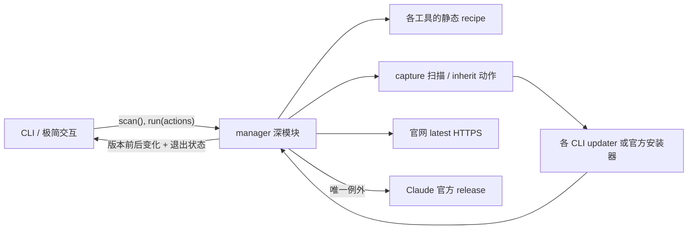

# ai-cli-manager 简化设计

> 目标：扩大工具覆盖，同时减少代码量、概念数量和用户决策。

## 结论

`ai-cli-manager` 不应继续尝试成为 npm、Homebrew、Bun、pnpm、Yarn、mise、
WinGet 等安装管理器的统一抽象。它只需要管理当前 shell 实际执行的命令：

1. 用各 CLI 的 `--version` 判断“已安装 / 未安装 / 版本不可读”；
2. 未安装时只提供一个经过审查的推荐安装入口；
3. 已安装时调用自身 updater；标准 macOS/Linux native Claude 是唯一例外，直连官方
   release 校验更新；
4. 更新后重新读取版本，并独立对比官网 latest；来源只参与 Claude 直连分派；
5. 执行前展示计划，动作输出继承终端。

管理器负责发现、编排、安全执行和结果呈现；其他来源的迁移、替换与回滚交给上游 CLI。

## 设计理由

- 来源盘点无法完整覆盖 npm、Homebrew、Bun、pnpm、mise 与系统包管理器；
- 安装入口不等于最终归属；
- 自建更新适配会重复上游已有的来源识别、校验和回滚能力。

因此只管理 `PATH` 当前命令。安装使用 [catalog](../../src/catalog.ts)，更新默认委托当前命令；
具体工具行为见 [README](../../README.md)。

## 产品语义

### 管理“当前命令”，不管理“所有安装副本”

`PATH` 决定实际执行的命令。管理器不盘点或操作被遮蔽的副本；来源只根据当前路径推断。

### 独立核验官网 latest，不信任 updater 的“最新版”结论

官网 latest 统一从 catalog 的 HTTPS 端点读取，不调用包管理器，也不解析 updater 输出。

默认 `status` 联网核验，`status --local` 保留完全本地化扫描。结果只允许四种语义：

- `current`：本地版本严格等于官网 latest；
- `outdated`：本地版本低于官网 latest；
- `ahead`：本地版本高于官网 latest，例如预发布或分阶段发布；
- `unavailable`：网络、HTTP、体积或解析失败，绝不降级成“最新版”。

写操作后统一复检；版本未变且仍落后时报告目标版本，不能写“已是最新”。

### 安装只给一个默认入口

安装只提供 catalog 推荐入口。替代来源由用户自行安装，再由 `PATH` 发现。

## manager 接口

CLI 和测试只跨 `manager` seam：

```ts
interface CliManager {
  scan(options?: { checkLatest?: boolean }): Promise<ToolStatus[]>;
  preview(action: Action): string;
  run(actions: Action[], options?: { verifyLatest?: boolean }): Promise<ActionResult[]>;
}

interface ToolStatus {
  id: ToolId;
  label: string;
  state: "missing" | "installed" | "unreadable";
  version?: string;
  source?: "official" | "homebrew" | "npm" | "bun" | "pnpm" | "mise" | "unknown";
  latestVersion?: string;
  updateState?: "current" | "outdated" | "ahead" | "unavailable";
}
```

路径解析、来源推断、latest、recipe、安全下载、进程生命周期和复检都留在模块内部。
`CommandRunner` 与注入的 `fetch` 是测试 seam。



Claude 直连保留为内部特例；出现第二种专用行为前不抽象 adapter。

## 交互

先选意图，再选择合法工具；安装和更新默认全选，卸载默认不选。提交后展示计划并确认，
卸载二次确认；空选退出，`Esc/q` 返回。动作继承终端。

## 实现约束

- 工具差异优先由 catalog 表达；
- 除 Claude 直连外，不新增 `tool.id === ...` 专用分支；
- 测试穿过 `manager` 验证可观察行为。

## 明确保留的安全能力

- 安装器只允许 HTTPS 和 catalog 白名单域名，包括 Codex 当前重定向到的
  `releases.openai.com`；
- 下载到临时文件、限制体积、执行后清理；
- Claude 直连使用唯一临时路径、不重试，`finally` 只尝试清理本次临时制品；
- 不通过 shell 拼接命令，参数以数组传递；
- 动作超时后终止整个进程树；
- 执行前显示将运行的上游命令或脚本 URL；
- 动作后复检，不把退出码 0 自动等价为“版本已更新”。

## 暂不做

- 不盘点 PATH 外的重复安装；
- 不替用户统一安装来源；
- 不解析 updater 输出；
- 除 Claude 直连外，不自行实现版本通道、迁移或回滚；
- 不为 catalog 提前抽象 plugin 系统。
